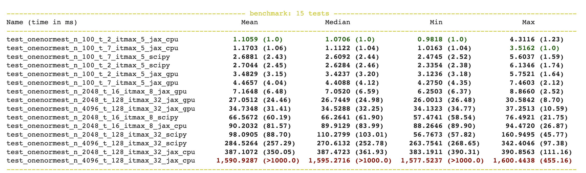

# Matrix One Norm Estimation

This is an implementation of matrix one norm estimation in jax as specified by http://eprints.maths.manchester.ac.uk/321/1/35608.pdf

## Testing

The implementation passes the scipy test suite with some minor relaxations, i.e. number of column resamples. Relaxed tests are documented in `./test_onenormest.py`

## Benchmarks

Some basic benchmarks using a GPU on the Google Colab free tier, see ~8x improvement from the scipy CPU implementation.

## Implementation details

There are existing implementations in [scipy](https://github.com/scipy/scipy/blob/59dac8a9fa9ea856f4a50521d295a3497d648faa/scipy/sparse/linalg/_onenormest.py) and [octave](https://github.com/gnu-octave/octave/blob/eff42b5a8c617f62a0ee1ddc2b70c246bbf32cb3/scripts/linear-algebra/normest1.m)

The algorithm as specified is imperative and control flow heavy. Additionally, a few variables have variable dimensions. The implementation has a few quirks to implement in jax.

### Early loop breaks
The main loop has many conditional early breaks. We handle this by manual continuation passing into a branch of `jax.lax.cond`.

### Fixed dimensions
`ind_hist` and `ind` must have fixed dimensions in the loop body. 

In the scipy implementation and Higham, `ind_hist` is a growable array that stores indices of the used unit vectors. In the octave implementation, `ind_hist` is a fixed sized array that writes 1 into index `j` when `e_j` is used.

`ind` is shape `(n,)` in Higham but only the first `t` values are read out of it. The first `t` values are read for writing to `ind_hist` and it is read out of with column indices of `Y` which is shape `(n, t)`. Because we only test elementary vectors a single time, it is not guaranteed we'll have `t` elementary vectors to test on each loop. We handle this by filling non used elements of `ind` with a sentinel value `n`. `n` will be used to fill a column in `X` with the zero vector instead of an elementary vector. These zero vectors will cause norm estimations of 0 which are always a correct underestimation of  the one norm. Note that because ind can have the additional sentinel value of `n`, `ind_hist` must be extended to length `n + 1`. Noting in `ind_hist` that the sentinel value has been used has no effect.

To implement in jax, the main loop body does manual continuation

